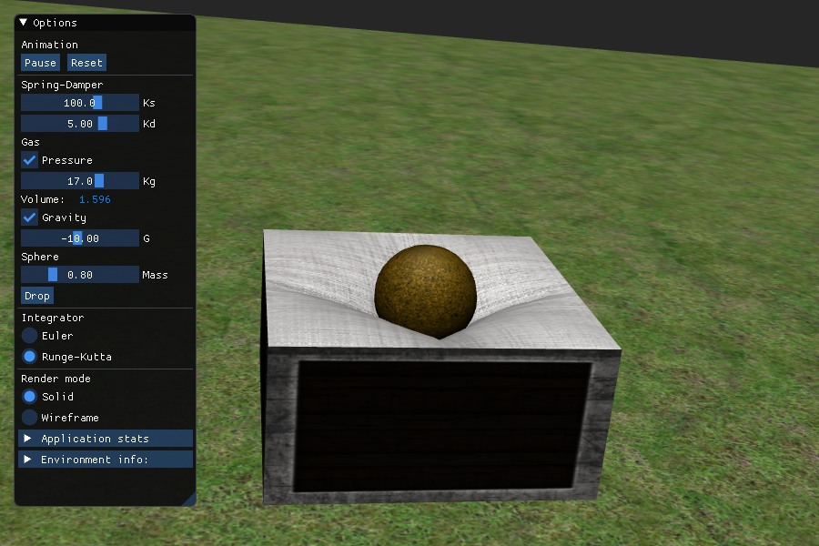

# SoftBody simulation

Esta programa aplica la idea que presentaron Matyka Maciej y Ollila Mark en su trabajo [Pressure Model of Soft Body Simulation](https://arxiv.org/abs/physics/0407003) para hacer una simulacion gráfica de un cuerpo neumático.



Este programa esta liberado bajo la [licencia de MIT](https://opensource.org/licenses/MIT)

El programa está escrito en C++ y utiliza OpenGL como API para hacer graficas. Requiere para compilarlo tener instaladas las bibliotecas [GLFW](https://www.glfw.org/), [GLEW](http://glew.sourceforge.net/), [GLM](https://github.com/g-truc/glm), [Assimp](https://assimp.org/) y [FreeImage](https://freeimage.sourceforge.io). Además usa la biblioteca [Dear Imgui](https://github.com/ocornut/imgui) para el menú de usuario, que está incluida en el código.

Hice pruebas para compilarlo bajo Windows y GNU/Linux. En particular en la distribución [Ubuntu](https://ubuntu.com/), todas las dependencias pueden ser instaladas usando el gestor de paquetes y luego compilar usando el [Makefile](/Makefile). Recomiendo usar [Eclipse CDT](https://www.eclipse.org/cdt/) como IDE, pero es un gusto personal no un requerimiento.

Si se tiene todas las dependencias instaladas, para compilar el programa solo se requiere:
```
make
make clean
```
El segundo comando `make clean` es opcional y solo elimina todos los archivos intermedions generados en la compilación.
